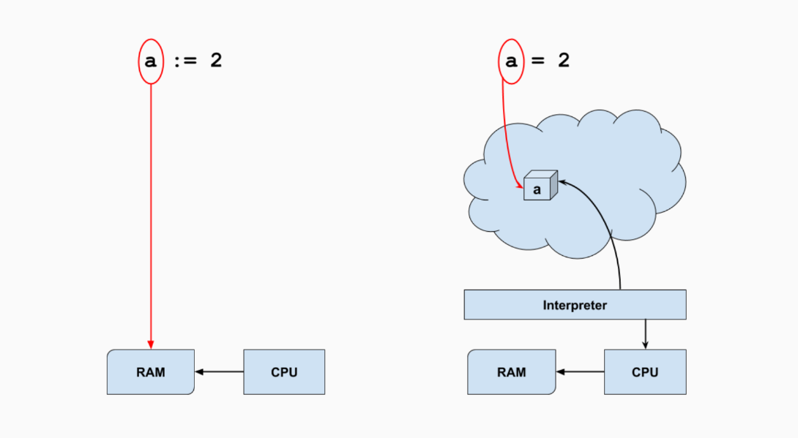
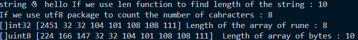
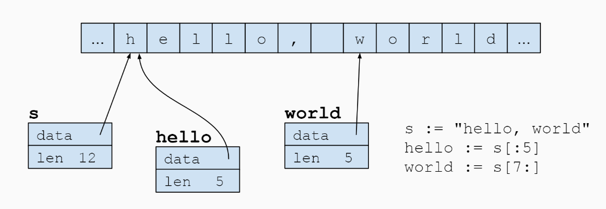
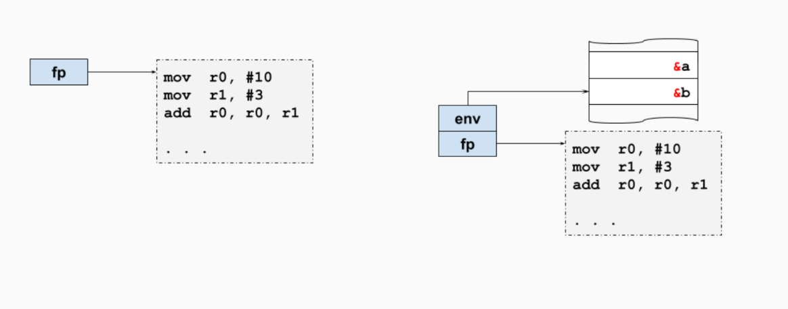

# Let's Go
This repository contains my learnings for each day about the fundamentals of the Go language.

> **_"A language that doesn't affect the way you think about programming is not worth knowing" - Alan J.Perlis_**

- ## **What is GO language?**
    - Go is a procedural programming language. It was developed in 2007 by Robert Griesemer, Rob Pike, and Ken Thompson at Google but launched in 2009 as an open-source programming language.Programs are assembled by using packages, for efficient management of dependencies.It is a statically typed, concurrent and garbage-collected programming language.
- ## **Inspiration**
    - Modern programming languages are getting complicated each day. It seems such that the languages are taking features from each other and converging into a single language. But this convergence comes with the cost of complexity. Although it may seem like each feature is making it simpler to code but they are also adding the additional burden of complexity behind the scenes.As Rob pike describes it, "Bloat without distinction". Additionally, there are multiple ways to do the same thing. One developer might traverse through a loop in one way and another developer might do it in another way. This makes the code less readable for the develoeprs. Go's inspiration was to make a language that is simple, readable and easy to maintain.
- ## **Feature Overview**
    - **Simplicity**: Go is simple to read and write. It has a clean and easy to understand syntax.
    - **Fast Compile Times**: Go is a compiled language. It is compiled to machine code. The compilation time is very fast.
    - **Garbage Collection**: Go has garbage collection. It automatically manages memory.
    - **Concurrency**: Go has goroutines which are lightweight threads. They are used to run functions concurrently. Also there are channels to help communicate between goroutines.
    - **Static Typing**: Go is statically typed. It helps in catching errors at compile time.
    - **Cross-Platform**: Go is cross-platform. It can be compiled on different platforms.
    - **Packages**: Go has a package system which makes it easy to manage dependencies.
    - **Interface**: Go has interfaces which can be implemented by struct and non-struct types.
    These features will be discussed in details below.
    - **Structs**: Go has structs which are used to define custom data types. They are similar to classes in object oriented programming languages.
- ## **Principles**
    Much like objected oriented programming languages , Go also has a set of principles that it follows.
    - ### **Don't communicate by sharing memory, share memory by communicating** 
        Go uses channels to communicate between different goroutines.This is in contrast to traditional threading models used in different languages where the threads communicate using share memory. Instead of doing that, passing references to data from one goroutine to another ensures that only one goroutine has access to the data at a given time.
    - ### **The bigger the interface, the weaker the abstraction**
        The smaller the interface is , the more helpful it is. If an interface has only one method, it is more helpful than an interface with multiple methods. This is because the smaller the interface, the more specific it is to the type that it is implemented on.In Go, interfaces are not implemented explicitly rather they are implementedimplicitly.If a type implements all the methods of an interface it means that the interface is implemented by the type."If a bird eats like a duck,swims like a duck and quacks like a duck, then it is a duck".
    - ### **Errors are values**
        Treating errors as values makes it easier and cleaner to handle errors. In Go, errors are values that can be returned from functions. If a function returns an error, it is the responsibility of the caller to handle the error.
- ## **How a Go Code is Compiled**
    When a Go code is compiled it is first transformed to bytecode. This bytecode is compiled to machine code by the Go compiler. The resutting machine code is stored in a executable file which can then be loaded into memory by the Go loader. While loading the executable to memory it does various tasks such as mapping to memory, initializing data structures required, security checks etc.
- ## **Features**
    - ### **Simplicity** :
        Go is simple to read and write.There are only 20 keywords present in the language. There are lesser built-in data types. This makes Go an easy to understand language. The syntax is clean and easy so that any developer can just tell what is happening in the code by seeing it. In other languages there are a lot of ways to do the same task. Go wants to get rid of that confusion. Instead the syntax is defined in such a way so that developers can easily read and write code.
    - ### **Fast Compile Time** : 
        Go is very well known for fast compile times. It is obviously faster than interpreted languages but it is also faster than a lot of compiled languages like C,C++ . Let's discuss how Go achieves fast compile times.
        - Dependency management
            Go has a package based system. This enables handling dependencies easily.Go does not allow unused dependencies and circular dependencies.
        - No symbol table for parsing
            Compiled languages like C++ often use symbol tables for compiling and also parsing the syntax to make a parse tree.Go does not use symbol tables for parsing. This makes the parsing faster than C,C++.
        - No header files
            Instead of using header files, Go uses a package system. This makes it easier to manage dependencies and thus improve performance.
        - No virtual machine
            Java and C# use virtual machines to run the code. Go does not use a virtual machine. It compiles the code to machine code directly.This makes it portable to different platforms as well as improves the compilation time as there is no middle man needed.
    - ### **Packages** : 
         Go is not an object oriented language.It uses packages to handle dependencies.Packaging is also done in other programming languages but we can choose to not do it if we don't want to.Instead,in Go it is a feature of the language itself. It can be compared to implementing the idea of microservices in source code level.We can think of each package as a different micro service which can be accessed through an api.
         Every package should have a purpose and its name should be very specific to what it does.It can be compared to the single responsibility principle in OOP where each method should have only one responsibility.In this case each package should have a very specific purpose.
         Each package should respect its impact on resources and performance of the user.
         Packages should be designed while keeping reusability in mind.This makes a package portable.Each package should be as decoupled as possible.
    - ### **Concurrency** : 
        One of the highlighting features of Go is its concurrency. Concurrent programming is not unique to Go ,other programming languages use threads to handle concurrency. But Go uses goroutines which are basically lightweight threads, therefore we can create thousands of these if we want. Now let's take a look at how concurrency is handled in Go.
        - Goroutines
                A goroutine is a function that is capable of running concurrently with other functions. To create a goroutine we use the keyword go followed by the function name. This will create a new goroutine which will run concurrently with the main goroutine.

                              
                package main
                import "fmt"

                func f(n int) {
                for i := 0; i < 10; i++ {
                    fmt.Println(n, ":", i)
                }
                }

                func main() {
                go f(0)
                var input string
                fmt.Scanln(&input)
                }

      
       Normally if we had just called the function f(0) it would have run in the main goroutine. But by using go f(0) we are creating a new goroutine which will run concurrently with the main goroutine.
            - Channels
                Channels provide a way for two goroutines to communicate with one another and synchronize their execution.
                Some rules that channels follow:
                - A channel type is represented with the keyword chan
                - the <- operator is used to send and receive messages from the channel
                - Suppose a <- b , b waits until a is ready to receive the message from b
                - We can specify channel direction which can be send only, receive only or both
                - Channels are asynchronous unless they are buffered channels. Buffered channels are asynchronous and does not wait for sending or recieveing messages unless the channel is full.Buffered channels are created using a second paramater inside the make function.
            - Select
                
        Normally if we had just called the function f(0) it would have run in the main goroutine. But by using go f(0) we are creating a new goroutine which will run concurrently with the main goroutine.
        - Channels
            Channels provide a way for two goroutines to communicate with one another and synchronize their execution.
            Some rules that channels follow:
            - A channel type is represented with the keyword chan
            - the <- operator is used to send and receive messages from the channel
            - Suppose a <- b , b waits until a is ready to receive the message from b
            - We can specify channel direction which can be send only, receive only or both
            - Channels are asynchronous unless they are buffered channels. Buffered channels are asynchronous and does not wait for sending or recieveing messages unless the channel is full.Buffered channels are created using a second paramater inside the make function.
        - Select
                The select statement works much like a switch case statement but for channels. It waits for any of the cases to be ready and executes the corresponding case. If multiple cases are ready, it randomly selects one of them.
    - ### **Garbage Collection** : 
        Go is a garbage collected language. This means that the memory is managed automatically by the Go runtime. The garbage collector runs in the background and reclaims memory that is no longer being used by the program. Languages like C don't heave this feature. In those languages the developer has to manually allocate and deallocate memory. This can lead to memory leaks and other problems.Go uses Tricolor mark and Sweep algorithm for garbage collection.
    - ### **Static Typing** : 
        Go is a statically typed language.The types are checked at compile time rather than runtime.This is another reason for which the compilation is faster. Even after being strictly typed, Go allows for type inference. This means that we don't have to explicitly mention the type of a variable. The compiler can infer the type of the variable from the value assigned to it at compile time.
        This feature makes it safer to handle errors as the compiler can catch type errors at compile time itself.Go has three basic data types which are bool, numeric and string. Numeric represents integer,floating point and complex types.
    - ### **Cross platform** : 
        Go is a cross platform language. This means that we can compile the code on one platform and run it on another platform. This is possible because Go compiles the code to machine code. This makes it easier to run the code on different platforms.There are other languages like Java and C# which are also cross platform but they use virtual machines to run the code. Go does not use a virtual machine. It compiles the code to machine code directly.
    - ### **Interface** : 
        Go is not an object oriented language and therefore it does not have the concept of classes or inheritance.Instead Go uses interfaces to achieve polymorphism. An interface is a set of methods that a type must implement if the type has to implement the interface. In Go we don't need to explicity implement an interface. It is done implicitly by the language if a type has implemented all the methods of an interface.There is also a concept of empty interface which is an interface with no methods. This can be used to store any type of value.
    - ### **Structs** : 
        Like C and C++ Go has a struct type. A struct is a collection of fields. It is used to define custom data types. It is similar to classes in object oriented programming languages except that it does not have any methods.
- ## **Comparison with other languages**
    In this section we want to compare Go with some other languages like Java, Python and C++.
    |  | Go | Java | Python | C++
    |--------|-|--------|------|----
    | Design | Simple and Minimial. Package based design. Shorter syntax and fewer language features. | Object oriented language with rich features. Lot of boilerplate code. | Object oriented language with massive standard library. Easy to read and write for beginners. | Object oriented language with rich features. 
    | Concurrency | Uses Goroutines and channels  | Uses threads | Uses threads | Uses threads
    | Speed | Incredible  | Good  | Slow | Fast
    | Memory Footprint | Low | High | High | Low 
    | Garbage Collection | Yes | Yes | Yes | No
    | Static Typing | Yes | Yes | No | Yes
    | Cross Platform | Yes | Yes | Yes | Yes
    | Object Oriented | No | Yes | Yes | Yes
    | Virtual Machine | No | Yes | Yes | No

- ## **Use Cases of Go**
    | | |
    |--------|--------|
    | Web Development | Go is used to make fast and scalable web application backends. |
    | Cloud & Network Services | With a strong ecosystem of tools and APIs for major cloud platforms , it is easy to build services with Go |
    | CLIs | Go is used to create fast and elegant CLIs |
    | DevOps & SRE | Because of fast build times and lean syntax, Go is built to support DevOps and SRE. |
        
- ## **Popular Companies that Use Go**
    - Google 
    - Uber
    - Twitch
    - Dropbox
    - Docker
    - Soundcloud

# Tutorial

## **Day 1**
- ### **Hello World**
    - To print Hello World in Go, we use the fmt package.
    ```go
    package main
    import "fmt"
    func main() {
        fmt.Println("Hello, World!")
    }
    ```
## **Day 2**
- ### **Basic Types**
    - Go has 25 keywords and a bunch of operators and symbols
    - **Constants** : Constants are declared using the const keyword. They are immutable.
    - **Functions** : make len cap new append copy close delete complex real imag panic recover
    - **Types** : bool string int int8 int16 int32 int64 uint uint8 uint16 uint32 uint64 uintptr byte rune float32 float64 complex128 complex64
    - **Machine-native vs Interpreted Variables** : <br>
        
        <br>
        In an interpreted language, the variable is an object that reperesents as a number to the interpreter. In a machine-native language, the variable is a memory location that holds a value.Therefore in machine-native language the operations are faster.
    - **Declaraing Variables** :
        - **var** : The var keyword is used to declare a variable. The type of the variable is mentioned after the variable name.
        - **:=** : The := operator is used to declare and initialize a variable. The type of the variable is inferred from the value assigned to it.

        ```go
        package main
        import "fmt"
        func main() {
            var a int = 10
            b := 20
            var(
                c = 30
                d = 40.1
            )
            c = 35
            fmt.Println(a,b,c,d)
        }
         ```

    - **Special Types** : 
        - bool : Boolean has only two values false and true and they are not the same as 0 and 1.
        - error : A special type with one function, Error().
        - Pointers : A pointer is a memory address. It is used to store the memory address of a variable.


    - **Zero Values** : If a variable is declared without being initialized, it is assigned a zero value. The zero value of a variable depends on its type.
    - **Type Conversion** : Go is a statically typed language. Therefore we need to convert the type of a variable if we want to assign it to another variable of a different type.
## **Day 3**
- ### **Control Structures**
    - **If Else** : The if else statement is used to execute a block of code if a condition is true. If the condition is false, the code inside the else block is executed.
    - **Switch** : The switch statement is used to execute a block of code based on the value of a variable. It is similar to a series of if else statements.
    - **For Loop** : The for loop is used to execute a block of code multiple times. It has three components: the init statement, the condition, and the post statement.
    - **Range** : The range keyword is used to iterate over items in a collection. It returns two values: the index and the value.
    - **Break** : The break statement is used to exit a loop.
    - **Continue** : The continue statement is used to skip the current iteration of a loop.
    - **Goto** : The goto statement is used to jump to a label in the code.
    - **Defer** : The defer keyword is used to delay the execution of a function until the surrounding function returns.
    - **Panic and Recover** : The panic function is used to cause a runtime error. The recover function is used to handle the panic and resume normal execution.
## **Day 4**
- ### **Strings**
    - byte : A synonym for uint8
    - rune : A synonym for int32 for characters
    - string : An immutable sequence of "characters" which is physically a sequence of bytes (UTF-8 encoding) and logically a sequence of (unicode) runes
    - Runes are enclosed in single quotes , they can be of multiple bytes 
    - Strings are immutable which means we cannot change a value of an index of a string. But we can however do string concatenation.
    - 
        ```go
        func t1() {
        s := "ও "
        s += " hello"
        fmt.Printf("%T %[1]v If we use len function to find length of the string : %d\n", s, len(s))
        fmt.Printf("If we use utf8 package to count the number of cahracters : %d\n", utf8.RuneCountInString(s))
        fmt.Printf("%T %[1]v Length of the array of rune : %d\n", []rune(s), len([]rune(s)))
        fmt.Printf("%T %[1]v  Length of array of bytes : %d\n", []byte(s), len([]byte(s)))
        }
        ```
    - Output:<br>
    
    <br>
    - Structure of string : <br>
    
    <br>
    - The [strings package](https://pkg.go.dev/strings) in Go offers a variety of different string related functions.

## **Day 5**
- ### **Arrays, Slices and Maps**
    - Arrays :
        - Arrays are a collection of elements of the same type.
        - The length of an array is fixed.
        - Arrays are passed by value.
        - The size of an array is part of its type.
        - Arrays are zero-indexed.
        - Arrays can be multi-dimensional.
        - Arrays are comparable and therefore can be used as map keys.
    - Slices :
        - Slices are a flexible version of arrays.
        - Slices are a reference to an underlying array.
        - Slices have a length and a capacity.
        - Slices are passed by reference.
        - Slices are zero-indexed.
        - Slices can be created using the make function.
        - Slices can be appended to.
        - Slices can be copied.
        - Slice are not comparable, therefore cannot be used as map keys.
        - A nil slice is a slice with a length and capacity of 0 which means no storage has been assigned to it whereas a slice with a length of 0 means that storage has been assigned to it but it is empty.The make function is used to make an empty slice.
    - Maps :
        - Maps are a collection of key-value pairs.
        - Maps are unordered.
        - Maps are passed by reference.
        - Maps are reference types.
        - Maps can be created using the make function.
        - Maps can be iterated over.
        - Maps can be deleted.
        - Maps can be used to implement sets , cache etc
        - A nil map is a map with no storage assigned to it.Therefore it is not possible to add keys to a nil map.
        - The make function is used to make an empty map which has a storage assigned to it.
        - mapName["key"] returns two values : the value and a boolean which is true if the key is present in the map and false if it is not present.

## **Day 6**
- ### **Control Statements , Declarations & Types**
    - **Control Statements** :
        - if-else : 
            ```go
            if condition {
                // code
            } else {
                // code
            }
            ```
        - switch-case : 
            ```go
            switch expression {
                case value1:
                    // code
                case value2:
                    // code
                default:
                    // code
            }
            ```
        - for loop : 
            ```go
            for init; condition; post {
                // code
            }
            ```
        - range : 
            ```go
            for index, value := range collection {
                // code
            }
            ```
        - break : 
            ```go
            for {
                if condition {
                    break
                }
            }
            ```
        - continue : 
            ```go
            for {
                if condition {
                    continue
                }
            }
            ```
        - Labels : 
            ```go
            outer:
            for {
                for {
                    break outer
                }
            }
            ```
    - **Packages**
        - Every standalone program has a main package.
        - Nothing is "global" ; it's either in one package or another.
        - There is function scope and package scope.
        - Every name that's capitalized is exported.Which means it can be accessed from other packages if the package is imported.
        - Unused import of packages give a compile error.
        - There is no circular dependency of packages in go.Which means if package "B" imports package "A" then package "A" cannot import package "B".
        - init function is used to initialize the package. It is called before the main function.
    - **Declarations**
        - The short declaration operator has some rules : 
            - It cannot be used outside of a function.
            - It must be used in a control statement instead of var.
            - It must declare at least one new variable.So cannot be used for redeclarations within the same scope.
    - **Structural Typing**
        - It's the same type if it has the same structure or behavior:
            - Arrays of the same size and base type
            - Structs with the same sequence of fields and types
            - Functions with the same sequence of parameter types and return types
            - Interfaces with the same methods
            - Slices with same base type
            - Maps of the same key and value types
    - **Named Typing**
        - It's only the same type if it has the same declared type name
        ```go
        type myInt int
        func main(){
            var a myInt
            a = 10
            var b int
            b = 10
            fmt.Println(a == b) // This will give an error
        }
        ```
    - **Type Conversion**
        - Go is a statically typed language. Therefore we need to convert the type of a variable if we want to assign it to another variable of a different type.
        - The conversion is done by using the type name in parentheses before the value.
        - The conversion is explicit and not implicit.
        - The conversion is not always possible. For example, we cannot convert a string to an int.
        - The conversion is not always safe. For example, converting a float to an int will truncate the decimal part.
    - **Basic Operators**
        - Arithmetic Operators : + - * / % ++ --
        - Relational Operators : == != > < >= <=
        - Logical Operators : && || !
        - Bitwise Operators : & | ^ << >> &^
        - Assignment Operators : = += -= *= /= %= <<= >>= &= ^= |= &^=
        - Misc Operators : & * <-
        - Operator precedence follows BODMAS rule or else left-to-right.

## **Day 7**
- ### **I/O**
    - Standard input,output,error (output) are the three standard I/O streams.
    - The fmt package uses refelction and can print anything
    <br><br>
    - **Standard I/O**<br><br>
    - Scan() , Scanf() , Scanln() functions are used to read input from the standard input
    - Println,Printf functions print to the standard output
    - Fprintlm,Fprintf functions print to anything that has the correct Write() method
    - Sprintl,Sprintf function returns a string
    - Format codes
        - %s - Uninterpreted bytes if the string or slice
        - %q - Double-quoted string
        - %c - Character
        - %d - Decimal integer
        - %x - Hexadecimal integer
        - %f - Floating-point number
        - %t - Boolean
        - %v - Any value
        - %T - Type of the value
        <br><br>
    - **File I/O**<br><br>
    - [Package os](https://pkg.go.dev/os) has functions to open or create files etc
    - [Packahe io](https://pkg.go.dev/io) has utilities to read and write files
    - [Package bufio](https://pkg.go.dev/bufio) provies the buffered I/O scanners etc
    - [Package io/ioutil](https://pkg.go.dev/io/ioutil) provides some utility functions such as reading an entire file to memory or writing out all at once.
    - [Package strconv](https://pkg.go.dev/strconv) has utilities to convert strings to numbers and vice versa.
    - A simple example of reading and writing to a file:
    ```go
    package main
    import (
        "fmt"
        "os"
    )
    func main() {
        file, err := os.Create("test.txt")
        if err != nil {
            fmt.Println(err)
            return
        }
        defer file.Close()
        file.WriteString("Hello, World!")
    }
    ```

## **Day 8**
- ### **Functions, Parameters & Defer**
    - Functions are first class object , which means we can
        - Define them - even inside another function
        - Create anonymous function literals
        - Pass them as function parameters/return values
        - Store them in variables
        - Store them in slices and maps (not as keys)
        - Store them as fields of a structure type
        - Send and recieve them in channels
        - Write methods against a function type
        - Compare a function var against nil
    - Paramaters are always passed by copying the value of something.If it is a slice which we said that is passed by reference it means that the pointer/descriptor is copied not the actual data.Therefore we can change the value of the slice within a function.
    - Functions can have multiple return values
    - Functions can have variadic parameters
    ```go
    package main
    import "fmt"
    func main() {
        fmt.Println(add(1, 2, 3, 4, 5))
    }
    func variadicExample(numbers ...int) int {
        sum := 0
        for _, number := range numbers {
            sum += number
        }
        return sum
    }
    func multipleReturnExample(number int)(int,bool){
        if number % 2 == 0 {
            return number,true
        }
        return number,false
    }
    ```
    - Defer statement captures a function call to return later
    - Defer is used to ensure that a function call is performed regardless of the outcome of the surrounding function when the function exits
    - The scope of a defer statement is the function, not a block
    - In case of multiple defer statements , the last defer statement is executed first
    - Commonly used in cases like closing files after opening it, close a socket or HTTP request , unlock a mutex etc.
    - Defer copies arguments to the deferred call , which means that if the arguments to a function are changed after the defer statement is called, the deferred function will still use the original values.
    - Defer can also call anonymous functions
    - Example
    ```go
    package main
    import "fmt"
    func main() {
        defer fmt.Println("World")
        fmt.Println("Hello")
    }
    ```
    - Output : Hello World
## **Day 9**
- ### **Closures**
    - A closure is when a function inside another function "closes over" one or more local variables of the outer function.
    - The function may access and assign to the referenced variables.
    - The function is bound to the variables.
    ```go
    {
        func fib() func() int{
            a,b := 0,1
            return func() int{
                a,b = b,a+b
                return a
            }
        }
        f := fib()
        for i := 0; i < 10; i++ {
            fmt.Println(f())
        }
    }
    ```

    - The inner function can access the variables of the outer function and changes them.Hence it needs to know where these variables are. Thus it is a closure.
    - The sort function takes help of closures to sort the whole slice of variables.
    - Normal function pointers vs closures : <br>
    
    <br><br>
    **Scope vs Lifetime**
    - Scope is static, based on the coee at compile time.
    - Lifetime depends on program execution (runtime). The lifetime of a variable can exceed the scope of the function where it is declared.For example : if we return the pointer to a variable , the variable lives on as long as someone has the pointer.In this case the variable is stored in the heap.

## **Day 10**
- ### **Slices in Detail** 
    - 


            

        
    

    

    


        
### References
- [Concurrency in Go](https://www.golang-book.com/books/intro/10)
- [dotGo 2015 - Rob Pike ](https://www.youtube.com/watch?v=rFejpH_tAHM&list=PLEcwzBXTPUE9V1o8mZdC9tNnRZaTgI-1P)
- [Gopherfest 2015 - Rob Pike ](https://www.youtube.com/watch?v=PAAkCSZUG1c&list=PLEcwzBXTPUE9V1o8mZdC9tNnRZaTgI-1P&index=4)
- [Package Oriented Design - William Kennedy](https://www.youtube.com/watch?v=spKM5CyBwJA&list=PLEcwzBXTPUE9V1o8mZdC9tNnRZaTgI-1P&index=9)
- [Why Golang compiles so fast? ](https://www.youtube.com/watch?v=BYsspvUqCbM)
- [Golang vs Java](https://www.matellio.com/blog/golang-vs-java/#:~:text=Go%20excels%20in%20terms%20of,may%20require%20more%20memory%20resources)
- [Golang vs Python](https://www.tftus.com/blog/python-vs-golang-which-language-to-choose#:~:text=Python%20is%20acclaimed%20for%20its,simplicity%2C%20performance%2C%20and%20extensibility)
- [Golang vs C++](https://codedamn.com/news/developer-tips/golang-vs-c-which-is-best-for-you)
- [Use cases of Golang](https://go.dev/solutions/use-cases)
- [Go Class](https://www.youtube.com/watch?v=nxWqANttAdA&list=PLoILbKo9rG3skRCj37Kn5Zj803hhiuRK6&index=1)


